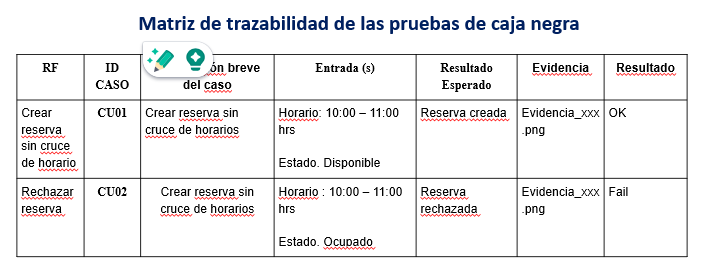

## Pruebas de caja negra

Deberán considerar una prueba de caja negra por cada requisito mandatorio (las otras pruebas son opcionales). Para ello deberá considerar:

- Como evidencias deberá incluir las capturas de pantalla o los logs del sistema.
- El formato a usar para la matriz de trazabilidad de las pruebas realizadas será el siguiente:

- En caso, haya alguna observación en algunas de las filas, podrá indicarlo fuera de la tabla como texto descriptivo de la observación con el fin de no saturar el contenido de la matriz de trazabilidad.

 

## Matriz de trazabilidad de las pruebas de caja negra
| RF     | ID CASO | Descripción breve del caso                    | Entrada(s)                                   | Resultado Esperado                 | Evidencia | Resultado |
|--------|---------|------------------------------------------------|-----------------------------------------------|------------------------------------|-----------|-----------|
| RF-01  | CU01    | Crear planificación anual                      | Año: 2025                                     | Planificación creada               |           | OK        |
| RF-01  | CU02    | Eliminar planificación anual                   | Año: 2025                                     | Planificación eliminada            |           | OK        |
| RF-02  | CU03    | Registrar unidad de aprendizaje                | Nombre: Matemática / Año: 2025               | Unidad registrada                  |           | OK        |
| RF-02  | CU04    | Eliminar unidad con sesiones asociadas        | Unidad: Matemática                            | Operación denegada                 |           | Fail      |
| RF-03  | CU05    | Asociar sesión a una unidad                    | Unidad: Matemática / Sesión: 01              | Sesión asociada                    |           | OK        |
| RF-04  | CU06    | Registrar sesión                               | Título: Sesión 01 / Fecha: 10-03-2025        | Sesión registrada                  |           | OK        |
| RF-06  | CU07    | Registrar asistencia                           | Estudiante X / Sesión 01                     | Asistencia registrada              |           | OK        |
| RF-07  | CU08    | Configurar umbral de faltas                    | Umbral: 30%                                   | Umbral registrado                  |           | OK        |
| RF-08  | CU09    | Superar umbral de faltas                       | Inasistencias >= 30%                          | Alerta visible en pantalla         |           | OK        |
| RF-09  | CU10    | Registrar capacidad cumplida                   | Estudiante X / Capacidad 1                   | Check registrado                   |           | OK        |
| RF-10  | CU11    | Calcular nivel automáticamente                 | 40% de capacidades                            | Nivel asignado: B                  |           | OK        |
| RF-11  | CU12    | Recalcular nivel tras modificación             | 40% → 70%                                     | Nivel actualizado a A              |           | OK        |
| RF-12  | CU13    | Consultar módulo individual del estudiante     | Estudiante X                                  | Vista consolidada mostrada         |           | OK        |
| RF-13  | CU14    | Crear área curricular                          | Nombre: Comunicación                          | Área registrada                    |           | OK        |

